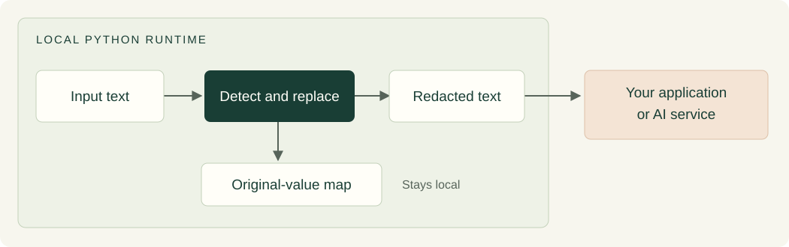

# Bowden-PII

Local PII detection and redaction for Swiss and European identifiers.

[](https://github.com/48Nauts-Operator/bowden-pii/actions/workflows/ci.yml)
[](https://github.com/48Nauts-Operator/bowden-pii/releases/tag/v0.0.1)
[](https://github.com/48Nauts-Operator/bowden-pii/blob/main/pyproject.toml)
[](LICENSE)

[Website](https://bowden-pii.com) · [Downloads](https://github.com/48Nauts-Operator/bowden-pii/releases/tag/v0.0.1) · [Project guide](https://bowden-pii.com/project.html) · [Blog](https://bowden-pii.com/blog/) · [Roadmap](https://bowden-pii.com/#roadmap) · [Contact](mailto:hello@bowden-pii.com)

**Version 0.0.1 is a developer preview.** Detect supported identifiers on your
own machine and replace them with typed placeholders before forwarding text.

This release provides a working Python API and command-line tool. The default
rules-based engine has no runtime dependencies and does not need a model or
network connection. It is early software for evaluation and integration work,
not a validated general-purpose anonymization system.

## How it works



The original-value map stays with your application. Send only the redacted
text to the next service. The rules engine runs without a model or network
connection.

| Available in 0.0.1 | Still experimental or planned |
| --- | --- |
| Python API and command-line redaction | Neural name and address detection |
| Checksum-aware identifier validation | Distributing trained model weights |
| Three policies and consistent placeholders | Neural processing of long documents |
| 36 focused tests and a small synthetic benchmark | Broader real-document evaluation |

## Install

Python 3.11 or newer is required. Clone the tagged release:

```sh
git clone --branch v0.0.1 --depth 1 https://github.com/48Nauts-Operator/bowden-pii.git
cd bowden-pii
python3 -m venv .venv
source .venv/bin/activate
python -m pip install .
```

On Windows, activate with `.venv\Scripts\Activate.ps1` in PowerShell.
You can also download the wheel from the release page and install it with
`python -m pip install bowden_pii-0.0.1-py3-none-any.whl`.

## Try it

```sh
bowden-pii "Contact mia@example.ch. AHV 756.9217.0769.85."
# Contact [EMAIL_1]. AHV [AHV_1].
```

The command reads standard input when no text argument is supplied:

```sh
printf '%s' 'Contact mia@example.ch' | bowden-pii --policy strict
```

Python API:

```python
from bowden_pii import redact

result = redact("Contact mia@example.ch", policy="strict")
print(result.redacted)  # Contact [EMAIL_1]
```

`detect(text)` returns detected spans. `redact(text)` also returns public span
metadata, an audit summary, and `placeholder_map`, which contains the original
values. Keep that map local. The CLI's `--json` output includes it; do not treat
that full JSON result as redacted output. Use `result.redacted` when forwarding text.

## Supported identifiers

- Swiss AHV/AVS/NSS, UID/CHE, and VAT suffixes (MWST, TVA, IVA, TPV).
- IBAN, Swiss QR-IBAN, and credit cards.
- Email addresses, conservative Swiss phone patterns, URLs, IP addresses, and MAC addresses.

Where applicable, rules validate checksums and formats. A valid checksum does
not establish that an identifier belongs to a real person or account.

Policies:

- `strict`: includes all supported deterministic identifier classes.
- `balanced`: preserves URLs.
- `permissive`: also preserves IP addresses, MAC addresses, and standalone UID values.

Repeated normalized values receive consistent placeholders within one result.
Cross-document/session mapping is the integrating application's responsibility.

## Experimental hybrid interfaces

The source includes `hybrid_detect`, `hybrid_redact`, and the MiniLM adapter to
preserve the experimental integration surface. **No trained model weights,
training datasets, or training tools are included in this release.** A source
checkout does not provide ready-to-run AI detection of names or addresses.

Advanced users may supply their own compatible detector to the hybrid API.
The optional `--mode hybrid --model-dir ...` path additionally requires PyTorch,
Transformers, and a compatible local token-classification checkpoint. It is not
part of the out-of-the-box quickstart. The adapter currently processes at most
256 tokens by default and does not chunk long documents.

## Limits and next steps

Detection can miss sensitive information or redact harmless values. Rules do
not identify arbitrary names, addresses, or contextual personal details.
Broader European coverage, long-text neural inference, independently labelled
real-document evaluation, and model distribution remain development work.
Synthetic fixtures and unit tests are useful checks, not proof of real-world
privacy guarantees. Review results for your use case before relying on them.

This public snapshot contains the runtime, focused tests, and one small
synthetic smoke fixture. Research collection/review tools, private history,
large corpora, and model binaries remain outside this release.

## Development

```sh
python -m pip install -e ".[dev]"
pytest
ruff check .
ruff format --check .
bowden-pii-benchmark data/benchmarks/deterministic_smoke.jsonl
```

The benchmark compares identifier label counts, not exact character boundaries.
GitHub Actions tests Python 3.11 and 3.14 and verifies that the package builds.

## Contact and feedback

Email [hello@bowden-pii.com](mailto:hello@bowden-pii.com) for project enquiries.
Report reproducible problems in [GitHub Issues](https://github.com/48Nauts-Operator/bowden-pii/issues).
Use synthetic examples in bug reports and leave out personal or confidential data.

See the [visual roadmap](https://bowden-pii.com/#roadmap) for the next work and
[release notes](https://bowden-pii.com/releases/) for what each download includes.

## About and license

Named in honor of Caspar Bowden. Independent and unaffiliated with his estate
or any organization. See the website for background and sources.

MIT license. Runtime and focused tests were exported from Forgejo implementation
commit `ebeed975920048e42bbb44c89a4342e3dc528214`; packaging and public documentation
were prepared for this release. The internal Git history is not published here.
